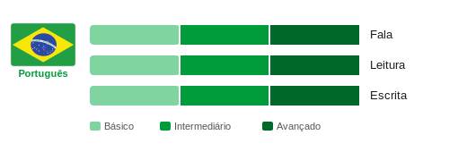
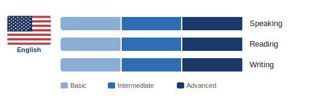
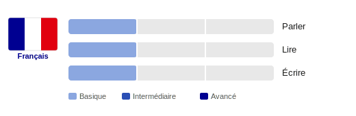
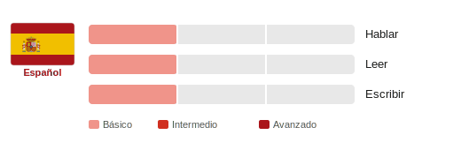

# 👾 Nathan Rodrigues

**`Computing Padawan`**

Graduated as an IT Technician at **IFMG** (Instituto Federal de Minas Gerais) and currently studying Computer Engineering at **UFMG** (Universidade Federal de Minas Gerais). Focused on building my academic and professional path in **Cybersecurity** and **AI**, across both software and hardware domains.

  &nbsp;
  

---

### 🖥️ Programming Languages & Technologies

  
  
  
  
  
  
  
  

  

---

### 🌐 Languages

<table border="0" cellspacing="0" cellpadding="6">
  <tr>
    <td>
      <picture>
        <source media="(prefers-color-scheme: dark)" srcset="./portuguese-dark.svg">
        
      </picture>
    </td>
    <td>
      <picture>
        <source media="(prefers-color-scheme: dark)" srcset="./english-dark.svg">
        
      </picture>
    </td>
  </tr>
  <tr>
    <td>
      <picture>
        <source media="(prefers-color-scheme: dark)" srcset="./french-dark.svg">
        
      </picture>
    </td>
    <td>
      <picture>
        <source media="(prefers-color-scheme: dark)" srcset="./spanish-dark.svg">
        
      </picture>
    </td>
  </tr>
</table>

---

### 📊 GitHub Stats

  
  

